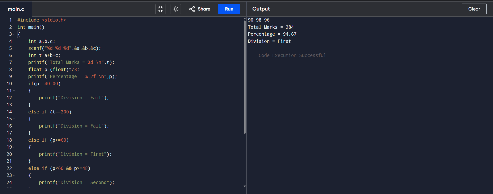

# EX-01-Datatypes-Operators
### Name : A.Sathya Narayanan
### Register number : 25016804

## AIM:
Write a C program to read 3 characters one by one and print the characters in a reverse order.

## ALGORITHM:
1.	Declare three character variables to store the input characters.
2.	Use the scanf function to read the characters one by one from the user.
3.	Print the characters in reverse order using the printf function.
4.	End the program.

## PROGRAM:
```
#include <stdio.h>
int main()  
{
    char ch1,ch2,ch3;
    scanf("%c",&ch1);
    scanf("%c",&ch2);
    scanf("%c",&ch3);
    printf("The reverse of %c%c%c is %c%c%c\n",ch1,ch2,ch3,ch3,ch2,ch1);
    return 0;
}
```

## OUTPUT:


## RESULT:
Thus the program to read 3 characters one by one and print the characters in a reverse order has been executed successfully.


# EX-02- Conditional-Statements
### Name : A.Sathya Narayanan
### Register number : 25016804
## AIM:
Write a C program to read A values and check whether A is positive number or not.

# ALGORITHM:
1.	Declare a variable to store the input value A.
2.	Use the scanf function to read the value of A from the user.
3.	Check if the value of A is greater than zero.
4.	If A is greater than zero, print a message indicating that it's a positive number. 
5.	Otherwise, print a message indicating that it's not a positive number.
6.End the program.

# PROGRAM:
```
#include <stdio.h>
int main()  
{
    int a;
    scanf("%d",&a);
    if(a>=0)
    {
        printf("a is positive number");
    }
    else
    {
        printf("a is not a positive number");
    }
    return 0;
}
```

# OUTPUT:


# RESULT:
Thus the program to read A values and check whether A is positive number or not has been executed successfully.
 
 
 


# EX-03- Operators-Expressions
### Name : A.Sathya Narayanan
### Register number : 25016804
## AIM:
Write a program to find minimum between two fraction numbers using conditional operator or ternary operator.

## ALGORITHM:
1.	Declare variables to store the two fraction numbers and the result.
2.	Use the printf function to prompt the user to enter the first fraction number (numerator and denominator separately).
3.	Use the scanf function to read the numerator and denominator of the first fraction.
4.	Repeat steps 2 and 3 to get the second fraction from the user.
5.	Calculate the decimal values of both fractions by dividing the numerators by the denominators.
6.	Use the conditional (ternary) operator to compare the decimal values and store the minimum value in the result variable.
7.	Print the minimum value.

## PROGRAM:
```
#include <stdio.h>
int main()  
{
    double num1,num2;
    scanf("%lf %lf",&num1,&num2);
    
    double min= (num1 < num2) ? num1 : num2;
    printf("Minimum between %.3f and %.3f is %.3f\n",num1,num2,min);
    return 0;
}
```

## OUTPUT:


## RESULT:
Thus the program to find minimum between two fraction numbers using conditional operator or ternary operator has been executed successfully.


# EX-04- Using Conditional Statements
### Name : A.Sathya Narayanan
### Register number : 25016804

## AIM:
Write a C program to check whether the input value is equal to 1 using simple if statement

## ALGORITHM:
1.	Declare a variable to store the input value.
2.	Use the scanf function to read the input value from the user.
3.	Use an if statement to check if the input value is equal to 1.
4.	If the condition in the if statement is true, print a message indicating that the input value is equal to 1.
5.	Otherwise, print a message indicating that it's not equal to 1.
6.	End the program.

## PROGRAM:
```
#include <stdio.h>
int main()  
{
    int a;
    scanf("%d",&a);
    if(a==1)
    {
        printf("The given input value is equal to 1\n");
    }
    else
    {
        printf("The given input value is not equal to 1\n");
    }
    return 0;
}
```

## OUTPUT:


## RESULT:
Thus the program to check whether the input value is equal to 1 using simple if statement has been executed successfully


# EX-05- Calculating Total, Percentage, And Division Using Conditional Statements 
### Name : A.Sathya Narayanan
### Register number : 25016804
## AIM:
To write a C program that reads marks of three subjects, calculates the total and percentage, and then determines the division (First, Second, Pass, or Fail) based on the percentage and minimum marks criteria.
## ALGORITHM:
1.	Start
2.	Declare integer variables m1, m2, m3 for marks, and float variables tot, per.
3.	Input the marks for three subjects.
4.	Calculate total marks: tot = m1 + m2 + m3
5.	Calculate percentage: per = tot / 3
6.	Display total and percentage.
7.	Check if all marks are greater than or equal to 40:
8.	If yes:
a.	If percentage >= 60: Print “Division = First”
b.	Else if percentage >= 48: Print “Division = Second”
c.	Else if percentage >= 36: Print “Division = Pass”
9.	Else: Print “Division = Fail”
10.	End


## PROGRAM:
```
#include <stdio.h>
int main()  
{
    int a,b,c;
    scanf("%d %d %d",&a,&b,&c);
    int t=a+b+c;
    printf("Total Marks = %d \n",t);
    float p=(float)t/3;
    printf("Percentage = %.2f \n",p);
    if(p==40.00)
    {
        printf("Division = Fail");
    }
    else if (t==200)
    {
        printf("Division = Fail");
    }
    else if (p>=60)
    {
        printf("Division = First");
    }
    else if (p<60 && p>=48)
    {
        printf("Division = Second");
    }
    else if (p<48 && p>=36)
    {
        printf("Division = Pass");
    }
    else
    {
        printf("Division = Fail");
    }
    return 0;
}
```

## OUTPUT:



## RESULT:
The program successfully takes three subject marks, calculates the total and percentage, and correctly determines the division based on predefined grading logic.
